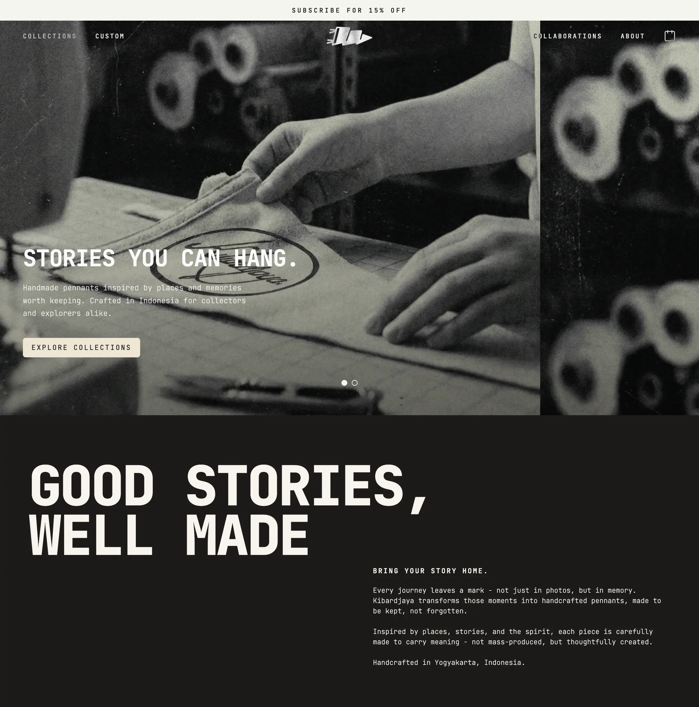
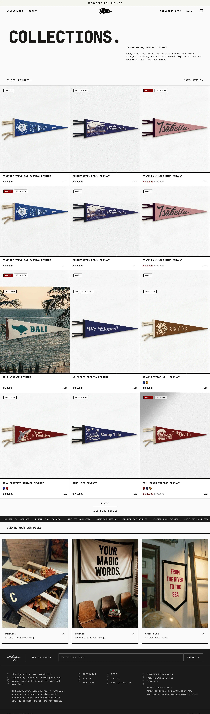
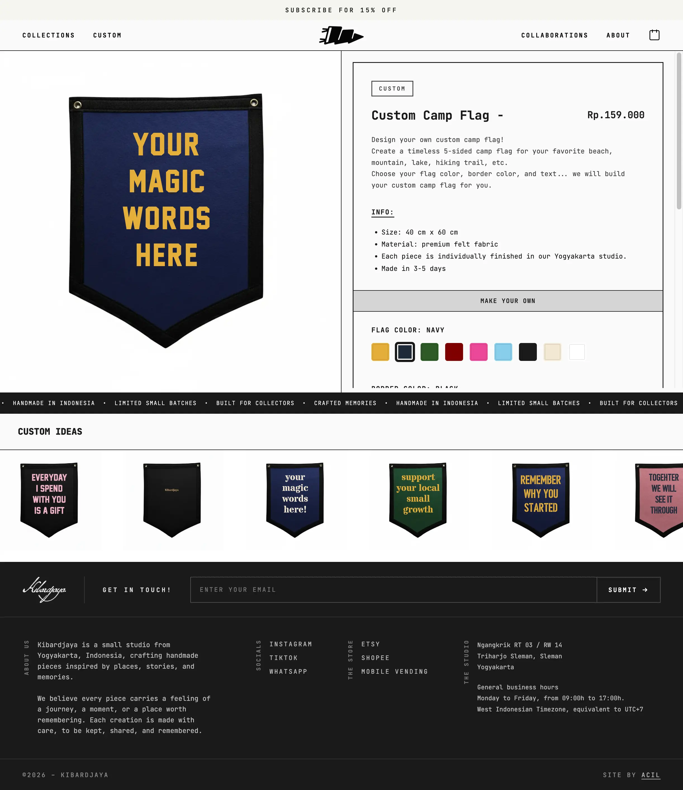
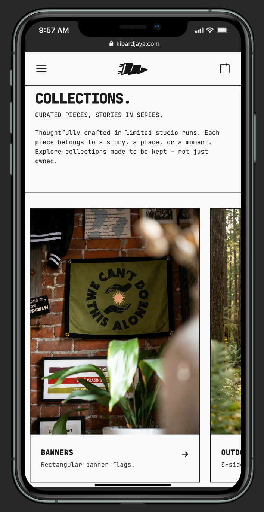

<div align="center">

# KIBARDJAYA PENNANT

### Stories You Can Hang.

Vintage-inspired handcrafted pennants from Indonesia.  
Built with Laravel and designed with a modern minimalist aesthetic.

<br>

[](https://laravel.com)
[](https://php.net)
[](https://tailwindcss.com)
[]()
[]()

<br>

### LIVE WEBSITE
👉 https://kibardjaya.com

<br>



</div>

---

# ABOUT THE PROJECT

Kibardjaya Pennant is a handcrafted pennant brand inspired by adventure, nostalgia, mountain culture, vintage souvenirs, and timeless storytelling.

This project combines:
- Modern web development
- Minimalist editorial layout
- Lifestyle e-commerce experience
- Vintage-inspired visual direction
- Responsive and immersive UI

The website is built as a modern showcase store experience with a strong focus on visual storytelling and branding.

---

# FEATURES

- Modern responsive storefront
- Lifestyle product gallery
- Vintage editorial layout
- Dynamic homepage sections
- Swiper-based hero slider
- Mobile-first responsive navigation
- Product detail experience
- WebP image optimization
- SEO-friendly structure
- Midtrans integration ready
- Filament admin panel
- Announcement bar system
- Clean minimalist UI
- Custom product builder for customer

---

# TECH STACK

| Technology | Usage |
|---|---|
| Laravel 11 | Backend Framework |
| PHP 8 | Server-side Language |
| TailwindCSS | Styling |
| Blade | Templating |
| Filament | Admin Panel |
| Alpine.js | Interactive UI |
| Swiper.js | Hero Slider |
| Vite | Asset Bundler |

---

# PROJECT PREVIEW

## Homepage



---

## Product Detail



---

## Mobile Experience

<div align="center">
    
</div>

---

# DESIGN DIRECTION

The visual direction is inspired by:

- Vintage outdoor culture
- Mountain expedition journals
- Old souvenir pennants
- Adventure photography
- Scandinavian minimalist layouts
- Editorial storytelling websites

---

# INSTALLATION

> ⚠️ This repository is a public showcase version.  
> Some proprietary modules, services, and production configurations are excluded.

## Clone Repository

```bash
git clone https://github.com/acilworks/kibardjaya-pennant.git
```

## Go To Project

```bash
cd kibardjaya-pennant
```

## Install Dependencies

```bash
composer install

npm install
```

## Environment Setup

```bash
cp .env.example .env
```

Generate application key:

```bash
php artisan key:generate
```

## Run Development Server

```bash
php artisan serve

npm run dev
```

---

# PROJECT STRUCTURE

```bash
app/
bootstrap/
config/
database/
public/
resources/
routes/
storage/
```

---

# PERFORMANCE & OPTIMIZATION

- Optimized asset loading
- WebP image support
- Lazy-loaded components
- Responsive image rendering
- Lightweight frontend architecture
- SEO-friendly semantic structure

---

# ROADMAP

- [ ] Custom order system
- [ ] International shipping integration
- [ ] Multi-language support
- [ ] Advanced storytelling pages
- [ ] Digital product support
- [ ] Membership & collector features

---

# BRAND PHILOSOPHY

Kibardjaya is more than a pennant store.

It is a collection of memories, places, stories, and adventures translated into physical objects designed to be displayed, collected, and remembered.

---

# AUTHOR

## Ahmad Arief Harwoko

Full-stack developer, fiber optic engineer, and independent brand builder from Sleman, Indonesia.

### Focus Areas
- Laravel Development
- UI/UX Design
- E-commerce Systems
- Branding & Storytelling
- Fiber Optic Infrastructure
- Digital Product Development

---

# CONNECT

- Portfolio Website: https://kibardjaya.com
- GitHub: https://github.com/acilworks

---

# LICENSE

© Kibardjaya.

This repository is provided for portfolio and showcase purposes only.

Commercial reuse, redistribution, or replication of proprietary assets and branding elements is prohibited.

---

<div align="center">

### STORIES YOU CAN HANG.


</div>